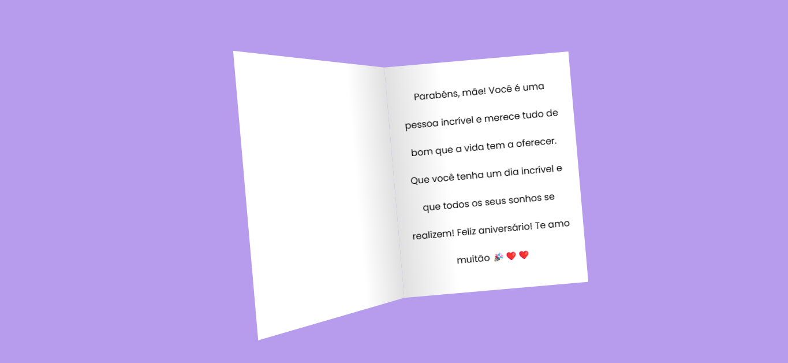

# 🎂 Carta de Aniversário Interativa - Para Minha Mãe ❤️

Este projeto é uma **carta de aniversário digital** desenvolvida com HTML e CSS, criada com muito amor e carinho para homenagear minha mãe em seu dia especial.

A carta tem formato de cartão interativo, com animações suaves e um **bolo animado com vela**, além de uma **mensagem personalizada** dentro. Ao passar o mouse, a carta se abre revelando o conteúdo interno.

---

## ✨ Funcionalidades

- 📜 Interface de cartão dobrável com efeito 3D
- 🎂 Animação de bolo de aniversário com vela
- 💌 Mensagem afetuosa interna
- 🎨 Estilo moderno com fonte personalizada
- 🌈 Cores suaves e visual acolhedor

---

## 📁 Estrutura dos Arquivos

- `index.html` → Contém a estrutura da carta
- `style2.css` → Responsável pelo estilo e animações

---

## 🖥️ Como visualizar

1. Baixe ou clone este repositório.
2. Abra o arquivo `index.html` em qualquer navegador moderno.

---

## 🛠️ Tecnologias utilizadas

- HTML5
- CSS3
- Google Fonts (Poppins)

---

## 📸 Captura de tela

